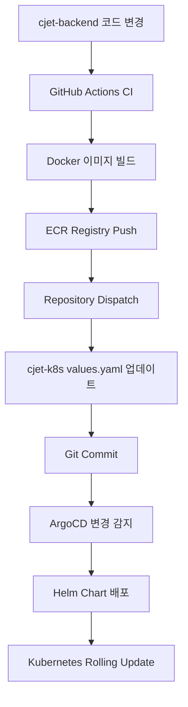

# ☸️ CloudJet Kubernetes - GitOps 배포 레포지토리

> **Helm + ArgoCD를 활용한 완전 자동화 GitOps 워크플로우**  
> CloudJet 마이크로서비스의 Kubernetes 배포 및 관리

[](https://argoproj.github.io/argo-cd/)
[](https://helm.sh/)
[](https://istio.io/)
[](https://aws.amazon.com/eks/)
[](https://keda.sh/)

---

## 🚀 **개요**

이 레포지토리는 **CloudJet 항공편 예약 시스템**의 Kubernetes 배포를 관리합니다.  
Helm 차트와 ArgoCD를 통해 완전 자동화된 GitOps 워크플로우를 제공합니다.

### 🎯 **주요 기능**
- 🔄 **완전 자동화**: 코드 변경 시 자동 배포
- ☸️ **Kubernetes Native**: Cloud Native 배포 전략
- 🛡️ **Istio 서비스 메시**: 트래픽 관리 및 보안
- 📊 **모니터링 통합**: Prometheus, Grafana, Kiali 연동
- 🔒 **보안**: External Secrets, RBAC, Network Policies
- ⚡ **자동 스케일링**: KEDA 기반 이벤트 드리븐 오토스케일링
- 🌍 **멀티 환경**: 개발/스테이징/운영 환경 자동 구성

---

## 🏗️ **아키텍처**

### **GitOps 워크플로우**


### **서비스 구조**
```
┌─────────────────────────────────────────────────────────────┐
│                     Istio Gateway                           │
│                  (External LoadBalancer)                    │
└─────────────────────┬───────────────────────────────────────┘
                      │
┌─────────────────────┴───────────────────────────────────────┐
│                 Virtual Service                             │
│              (Traffic Routing)                              │
└─┬─────────────┬─────────────┬─────────────┬─────────────────┘
  │             │             │             │
┌─▼─────┐ ┌─────▼─┐ ┌─────────▼┐ ┌─────────▼┐ ┌──────────────▼┐
│ Auth  │ │Flight │ │ Booking │ │ Admin   │ │    Payment    │
│Service│ │Service│ │ Service │ │Service  │ │   Service     │
│(5001) │ │(5002) │ │ (5003)  │ │(5004)   │ │   (5005)      │
└───────┘ └───────┘ └─────────┘ └─────────┘ └───────────────┘
```

### **네임스페이스 구조**
- `user`: 사용자 대상 서비스 (auth, flight, booking)
- `admin`: 관리자 서비스 (admin-service, payment-service)
- `monitoring`: 모니터링 스택 (Prometheus, Grafana, Kiali)
- `istio-system`: Istio 컨트롤 플레인

---

## 📦 **Helm 차트 구조**

```
helm/
├── Chart.yaml                    # Helm 차트 메타데이터
├── values.yaml                   # 기본 설정 값
├── values-dev.yaml               # 개발 환경 설정
├── values-prod.yaml              # 운영 환경 설정
├── templates/
│   ├── deployments.yaml         # 마이크로서비스 배포
│   ├── services.yaml            # 서비스 정의
│   ├── configmap.yaml           # 설정 맵
│   ├── external-secrets.yaml    # AWS Secrets Manager 연동
│   ├── serviceaccounts.yaml     # 서비스 계정
│   ├── namespace.yaml           # 네임스페이스 생성
│   ├── gateway.yaml             # Istio Gateway
│   ├── virtualservice.yaml      # Istio Virtual Service
│   ├── destinationrule.yaml     # Istio Destination Rules
│   ├── admin-namespace-mtls.yaml # mTLS 정책
│   ├── keda-scaledobject.yaml   # KEDA 오토스케일링
│   ├── istio-gateway-service.yaml # 게이트웨이 서비스
│   └── servicemonitor.yaml      # Prometheus 모니터링
└── .helmignore
```

---

## ⚙️ **values.yaml 구성**

### **글로벌 설정**
```yaml
global:
  namespace: user
  applicationNamespaces: ["user", "admin"]
  imagePullPolicy: Always

services:
  auth:
    name: auth-service
    image:
      repository: public.ecr.aws/v3g6g4v7/cj-auth-svc
      tag: latest
    port: 5001
    replicas: 2
    
  flight:
    name: flight-service
    image:
      repository: public.ecr.aws/v3g6g4v7/cj-flight-svc
      tag: latest
    port: 5002
    replicas: 2
```

### **보안 설정**
```yaml
secrets:
  externalSecrets:
    enabled: true
    serviceAccountName: cloudjet-secrets-sa
    secretStore:
      name: aws-secrets-store
      region: ap-northeast-2
```

### **Istio 설정**
```yaml
istio:
  gateway:
    enabled: true
    hosts:
      - cloudjet.example.com
  virtualService:
    enabled: true
    routes:
      - match:
          - uri:
              prefix: /api/auth
        route:
          - destination:
              host: auth-service
```

---

## 🚀 **배포 가이드**

### **Prerequisites**
- Kubernetes 1.24+
- Helm 3.0+
- Istio 1.27+
- ArgoCD 2.8+
- kubectl 접근 권한

### **1. 네임스페이스 생성**
```bash
kubectl create namespace cloudjet
kubectl create namespace monitoring
```

### **2. Istio 라벨링**
```bash
kubectl label namespace cloudjet istio-injection=enabled
```

### **3. Helm을 사용한 배포**
```bash
# 레포지토리 클론
git clone https://github.com/Cloud-Jet/cjet-k8s-public.git
cd cjet-k8s-public

# Helm 배포
helm install cloudjet ./helm -n cloudjet

# 또는 특정 값으로 배포
helm install cloudjet ./helm -n cloudjet \
  --set services.auth.image.tag=v1.0.0 \
  --set services.auth.replicas=3
```

### **4. ArgoCD Application 생성**
```bash
argocd app create cloudjet-app \
  --repo https://github.com/Cloud-Jet/cjet-k8s-public.git \
  --path helm \
  --dest-server https://kubernetes.default.svc \
  --dest-namespace cloudjet \
  --sync-policy automated \
  --auto-prune \
  --self-heal
```

---

## 🔧 **설정 관리**

### **환경별 설정**

#### **개발 환경 (values-dev.yaml)**
```yaml
global:
  environment: development

services:
  auth:
    replicas: 1
    resources:
      requests:
        memory: "128Mi"
        cpu: "100m"
```

#### **운영 환경 (values-prod.yaml)**
```yaml
global:
  environment: production

services:
  auth:
    replicas: 3
    resources:
      requests:
        memory: "256Mi"
        cpu: "250m"
      limits:
        memory: "512Mi"
        cpu: "500m"
```

### **환경별 배포**
```bash
# 개발 환경
helm upgrade cloudjet ./helm -n cloudjet-dev -f values-dev.yaml

# 운영 환경  
helm upgrade cloudjet ./helm -n cloudjet-prod -f values-prod.yaml
```

---

## 🛡️ **보안**

### **External Secrets Operator**
```yaml
# AWS Secrets Manager 연동
apiVersion: external-secrets.io/v1beta1
kind: ExternalSecret
metadata:
  name: cloudjet-unified-secret
spec:
  secretStoreRef:
    name: aws-secrets-store
    kind: SecretStore
  target:
    name: cloudjet-secrets
    creationPolicy: Owner
  data:
    - secretKey: SECRET_KEY
      remoteRef:
        key: cloudjet/secrets
        property: SECRET_KEY
```

### **Service Account & RBAC**
```yaml
apiVersion: v1
kind: ServiceAccount
metadata:
  name: cloudjet-secrets-sa
  annotations:
    eks.amazonaws.com/role-arn: arn:aws:iam::556683426101:role/cloudjet-secrets-role
```

### **Network Policies**
```yaml
apiVersion: networking.k8s.io/v1
kind: NetworkPolicy
metadata:
  name: cloudjet-network-policy
spec:
  podSelector:
    matchLabels:
      app: cloudjet
  policyTypes:
  - Ingress
  - Egress
  ingress:
  - from:
    - namespaceSelector:
        matchLabels:
          name: istio-system
```

---

## ⚡ **자동 스케일링 (KEDA)**

### **KEDA ScaledObject 설정**
```yaml
apiVersion: keda.sh/v1alpha1
kind: ScaledObject
metadata:
  name: auth-service-scaler
spec:
  scaleTargetRef:
    name: auth-service
  minReplicaCount: 2
  maxReplicaCount: 10
  triggers:
  - type: prometheus
    metadata:
      serverAddress: http://prometheus:9090
      metricName: http_requests_per_second
      threshold: '30'
      query: sum(rate(http_requests_total{job="auth-service"}[1m]))
```

### **지원되는 스케일링 트리거**
- **Prometheus 메트릭**: CPU, 메모리, 사용자 정의 메트릭
- **HTTP 요청량**: 요청 처리량 기반 스케일링
- **Redis Queue**: 메시지 큐 길이 기반
- **AWS CloudWatch**: AWS 네이티브 메트릭 연동

### **스케일링 정책**
```yaml
behavior:
  scaleDown:
    stabilizationWindowSeconds: 300
    policies:
    - type: Percent
      value: 10
      periodSeconds: 60
  scaleUp:
    stabilizationWindowSeconds: 0
    policies:
    - type: Percent
      value: 100
      periodSeconds: 15
```

---

## 📊 **모니터링**

### **Prometheus 연동**
```yaml
# ServiceMonitor for Prometheus
apiVersion: monitoring.coreos.com/v1
kind: ServiceMonitor
metadata:
  name: cloudjet-monitor
spec:
  selector:
    matchLabels:
      app: cloudjet
  endpoints:
  - port: metrics
    interval: 30s
    path: /metrics
```

### **Grafana 대시보드**
- **애플리케이션 메트릭**: CPU, 메모리, 응답 시간
- **비즈니스 메트릭**: 예약 수, 결제 성공률, 사용자 활동
- **Istio 메트릭**: 트래픽, 에러율, 레이턴시
- **KEDA 메트릭**: 스케일링 이벤트, 파드 수 변화
- **AWS EKS 메트릭**: 노드 상태, 클러스터 리소스

### **알람 설정**
```yaml
# PrometheusRule
apiVersion: monitoring.coreos.com/v1
kind: PrometheusRule
metadata:
  name: cloudjet-alerts
spec:
  groups:
  - name: cloudjet.rules
    rules:
    - alert: HighErrorRate
      expr: rate(http_requests_total{status=~"5.."}[5m]) > 0.1
      for: 5m
      annotations:
        summary: "High error rate detected"
```

---

## 🔄 **CI/CD 통합**

### **자동 배포 프로세스**

1. **코드 변경 감지**: cjet-backend 레포지토리 변경
2. **이미지 빌드**: GitHub Actions에서 Docker 이미지 생성
3. **values.yaml 업데이트**: CD 워크플로우가 자동으로 태그 업데이트
4. **ArgoCD 동기화**: 변경사항 감지 및 자동 배포
5. **롤링 업데이트**: 무중단 서비스 업데이트

### **배포 전략**
```yaml
# Rolling Update 설정
strategy:
  type: RollingUpdate
  rollingUpdate:
    maxUnavailable: 25%
    maxSurge: 25%

# Health Check
livenessProbe:
  httpGet:
    path: /api/auth/health
    port: 5001
  initialDelaySeconds: 30
  periodSeconds: 10

readinessProbe:
  httpGet:
    path: /api/auth/health
    port: 5001
  initialDelaySeconds: 5
  periodSeconds: 5
```

---

## 🧪 **테스트**

### **Helm 차트 테스트**
```bash
# 템플릿 렌더링 테스트
helm template cloudjet ./helm --debug

# 문법 검사
helm lint ./helm

# 드라이런 테스트
helm install cloudjet ./helm --dry-run --debug
```

### **배포 후 검증**
```bash
# 모든 파드 상태 확인
kubectl get pods -n cloudjet

# 서비스 연결 테스트
kubectl exec -n cloudjet deployment/auth-service -- curl http://auth-service:5001/api/auth/health

# Istio 트래픽 확인
kubectl exec -n istio-system deployment/istiod -- istioctl proxy-status
```

---

## 🚨 **트러블슈팅**

### **일반적인 문제들**

#### **1. 파드가 시작되지 않는 경우**
```bash
# 이벤트 확인
kubectl describe pod <pod-name> -n cloudjet

# 로그 확인
kubectl logs <pod-name> -n cloudjet -f

# 리소스 확인
kubectl top pods -n cloudjet
```

#### **2. 서비스 연결 문제**
```bash
# 서비스 엔드포인트 확인
kubectl get endpoints -n cloudjet

# DNS 해결 테스트
kubectl exec -n cloudjet deployment/auth-service -- nslookup flight-service

# Istio 설정 확인
istioctl analyze -n cloudjet
```

#### **3. 외부 접근 문제**
```bash
# 게이트웨이 상태 확인
kubectl get gateway -n cloudjet

# Virtual Service 확인
kubectl get vs -n cloudjet

# 로드밸런서 IP 확인
kubectl get svc -n istio-system istio-ingressgateway
```

---

## 🔄 **업데이트 가이드**

### **버전 업데이트**
```bash
# 특정 서비스만 업데이트
helm upgrade cloudjet ./helm -n cloudjet \
  --set services.auth.image.tag=v2.0.0

# 전체 업데이트
git pull origin main
helm upgrade cloudjet ./helm -n cloudjet
```

### **롤백**
```bash
# 롤백 이력 확인
helm history cloudjet -n cloudjet

# 이전 버전으로 롤백
helm rollback cloudjet 1 -n cloudjet

# Kubernetes 네이티브 롤백
kubectl rollout undo deployment/auth-service -n cloudjet
```

---

## 📋 **체크리스트**

### **배포 전 확인사항**
- [ ] Kubernetes 클러스터 접근 가능
- [ ] Istio 설치 및 구성 완료
- [ ] KEDA 오퍼레이터 설치
- [ ] AWS Secrets Manager 설정
- [ ] ECR 레지스트리 접근 권한
- [ ] 네임스페이스 생성 및 라벨링
- [ ] External Secrets Operator 설치

### **배포 후 확인사항**
- [ ] 모든 파드 Running 상태
- [ ] 서비스 연결성 테스트
- [ ] 외부 접근 가능 여부
- [ ] Health Check 정상 동작
- [ ] 모니터링 메트릭 수집
- [ ] KEDA 스케일링 동작 확인
- [ ] Istio mTLS 적용 확인

---

## 🤝 **기여하기**

### **기여 프로세스**
1. **Fork** 레포지토리
2. **Feature Branch** 생성
3. **변경사항 구현** 및 테스트
4. **Pull Request** 생성
5. **코드 리뷰** 및 병합

### **개발 가이드라인**
- Helm 모범 사례 준수
- YAML 문법 검사 필수
- 변경사항에 대한 문서 업데이트
- 템플릿 주석 및 설명 추가

---

## 📞 **지원**

- **GitHub Issues**: [cjet-k8s Issues](https://github.com/Cloud-Jet/cjet-k8s-public/issues)
- **Wiki**: [프로젝트 위키](https://github.com/Cloud-Jet/cjet-k8s-public/wiki)
- **관련 프로젝트**: [cjet-backend](https://github.com/Cloud-Jet/cjet-backend-public)

---

**⭐ 이 프로젝트가 유용하다면 Star를 눌러주세요!**