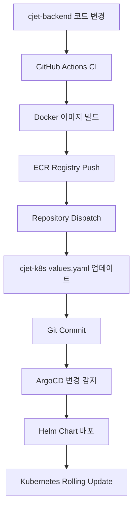
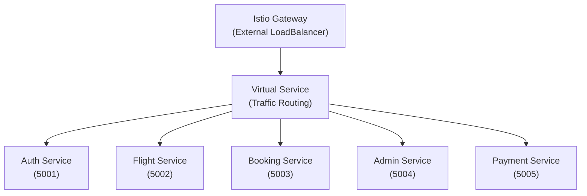

# CloudJet Kubernetes - GitOps 배포 레포지토리
 
Helm과 ArgoCD 기반으로 CloudJet 마이크로서비스를 Kubernetes에 배포하고 관리하는 레포지토리입니다.
 
## 개요
 
CloudJet 항공편 예약 시스템의 Kubernetes 배포를 관리합니다. 코드 변경부터 배포까지의 과정을 ArgoCD가 Git 상태와 동기화하는 방식으로 처리합니다.
 
구성 요소는 다음과 같습니다.
 
- 코드 변경 시 ArgoCD가 Git 변경을 감지해 자동 배포
- Istio 서비스 메시를 통한 트래픽 관리 및 mTLS
- Prometheus, Grafana, Kiali, Jaeger, Loki로 구성된 관측성 스택
- External Secrets, RBAC, Network Policy 기반 보안 설정
- KEDA를 이용한 이벤트 기반 오토스케일링
- 개발/스테이징/운영 환경별 values 분리
## 아키텍처
 
### GitOps 워크플로우
 

```mermaid
graph TD
    A[cjet-backend 코드 변경] --> B[GitHub Actions CI]
    B --> C[Docker 이미지 빌드]
    C --> D[ECR Registry Push]
    D --> E[Repository Dispatch]
    E --> F[cjet-k8s values.yaml 업데이트]
    F --> G[Git Commit]
    G --> H[ArgoCD 변경 감지]
    H --> I[Helm Chart 배포]
    I --> J[Kubernetes Rolling Update]
```
 
### 서비스 구조
 

```mermaid
graph TD
    GW["Istio Gateway<br/>(External LoadBalancer)"] --> VS["Virtual Service<br/>(Traffic Routing)"]
    VS --> AUTH["Auth Service<br/>(5001)"]
    VS --> FLIGHT["Flight Service<br/>(5002)"]
    VS --> BOOKING["Booking Service<br/>(5003)"]
    VS --> ADMIN["Admin Service<br/>(5004)"]
    VS --> PAYMENT["Payment Service<br/>(5005)"]
```
 
### 네임스페이스 구조
 
- `user`: 사용자 대상 서비스 (auth, flight, booking)
- `admin`: 관리자 서비스 (admin-service, payment-service)
- `monitoring`: 관측성 스택 (Prometheus, Grafana, Kiali, Jaeger, Loki)
- `istio-system`: Istio 컨트롤 플레인
- `keda`: KEDA 오토스케일링 오퍼레이터
## Helm 차트 구조
 
```
helm/
├── Chart.yaml                    # Helm 차트 메타데이터
├── values.yaml                   # 기본 설정 값
├── values-dev.yaml               # 개발 환경 설정
├── values-prod.yaml              # 운영 환경 설정
├── templates/
│   ├── deployments.yaml          # 마이크로서비스 배포
│   ├── services.yaml             # 서비스 정의
│   ├── configmap.yaml            # 설정 맵
│   ├── external-secrets.yaml     # AWS Secrets Manager 연동
│   ├── serviceaccounts.yaml      # 서비스 계정
│   ├── namespace.yaml            # 네임스페이스 생성
│   ├── gateway.yaml              # Istio Gateway
│   ├── virtualservice.yaml       # Istio Virtual Service
│   ├── destinationrule.yaml      # Istio Destination Rules
│   ├── admin-namespace-mtls.yaml # mTLS 정책
│   ├── keda-scaledobject.yaml    # KEDA 오토스케일링
│   ├── istio-gateway-service.yaml # 게이트웨이 서비스
│   └── servicemonitor.yaml       # Prometheus 모니터링
└── .helmignore
```
 
## values.yaml 구성
 
### 기본 설정
 
```yaml
global:
  namespace: user
  applicationNamespaces: ["user", "admin"]
  imagePullPolicy: Always
 
services:
  auth:
    name: auth-service
    image:
      repository: public.ecr.aws/v3g6g4v7/cj-auth-svc
      tag: v5.0.0
    port: 5001
    replicas: 2
    resources:
      requests:
        memory: "256Mi"
        cpu: "250m"
      limits:
        memory: "512Mi"
        cpu: "500m"
 
  admin:
    name: admin-service
    namespace: admin  # Admin 전용 네임스페이스
    replicas: 1
```
 
### 보안 설정
 
```yaml
# ServiceAccount with IAM Role 연동
serviceAccounts:
  accounts:
    - name: cloudjet-secrets-sa
      roleArn: arn:aws:iam::556683426101:role/CloudJetSecretsRole
      namespaces: ["user", "admin"]
 
# External Secrets 설정
secrets:
  externalSecrets:
    enabled: true
    storeName: aws-secrets-store
    serviceAccountName: cloudjet-secrets-sa
```
 
### Istio 설정
 
```yaml
istio:
  gateway:
    enabled: true
    hosts:
      - cloudjet.example.com
  virtualService:
    enabled: true
    routes:
      - match:
          - uri:
              prefix: /api/auth
        route:
          - destination:
              host: auth-service
```
 
## 배포 가이드
 
### 사전 요구사항
 
- Kubernetes 1.24+
- Helm 3.0+
- Istio 1.27+
- ArgoCD 2.8+
- kubectl 접근 권한
### 1. 네임스페이스 생성
 
```bash
kubectl create namespace cloudjet
kubectl create namespace monitoring
```
 
### 2. Istio 라벨링
 
```bash
kubectl label namespace cloudjet istio-injection=enabled
```
 
### 3. Helm 배포
 
```bash
# 레포지토리 클론
git clone https://github.com/Cloud-Jet/cjet-k8s-public.git
cd cjet-k8s-public
 
# Helm 배포
helm install cloudjet ./helm -n cloudjet
 
# 또는 특정 값으로 배포
helm install cloudjet ./helm -n cloudjet \
  --set services.auth.image.tag=v1.0.0 \
  --set services.auth.replicas=3
```
 
### 4. ArgoCD Application 생성
 
```bash
argocd app create cloudjet-app \
  --repo https://github.com/Cloud-Jet/cjet-k8s-public.git \
  --path helm \
  --dest-server https://kubernetes.default.svc \
  --dest-namespace cloudjet \
  --sync-policy automated \
  --auto-prune \
  --self-heal
```
 
## 설정 관리
 
### 환경별 설정
 
개발 환경 (values-dev.yaml)
 
```yaml
global:
  environment: development
 
services:
  auth:
    replicas: 1
    resources:
      requests:
        memory: "128Mi"
        cpu: "100m"
```
 
운영 환경 (values-prod.yaml)
 
```yaml
global:
  environment: production
 
services:
  auth:
    replicas: 3
    resources:
      requests:
        memory: "256Mi"
        cpu: "250m"
      limits:
        memory: "512Mi"
        cpu: "500m"
```
 
### 환경별 배포
 
```bash
# 개발 환경
helm upgrade cloudjet ./helm -n cloudjet-dev -f values-dev.yaml
 
# 운영 환경
helm upgrade cloudjet ./helm -n cloudjet-prod -f values-prod.yaml
```
 
## 보안
 
### External Secrets Operator
 
```yaml
# AWS Secrets Manager 연동
apiVersion: external-secrets.io/v1beta1
kind: ExternalSecret
metadata:
  name: cloudjet-unified-secret
spec:
  secretStoreRef:
    name: aws-secrets-store
    kind: SecretStore
  target:
    name: cloudjet-secrets
    creationPolicy: Owner
  data:
    - secretKey: SECRET_KEY
      remoteRef:
        key: cloudjet/secrets
        property: SECRET_KEY
```
 
### Service Account & RBAC
 
```yaml
apiVersion: v1
kind: ServiceAccount
metadata:
  name: cloudjet-secrets-sa
  annotations:
    eks.amazonaws.com/role-arn: arn:aws:iam::556683426101:role/cloudjet-secrets-role
```
 
### Network Policies
 
```yaml
apiVersion: networking.k8s.io/v1
kind: NetworkPolicy
metadata:
  name: cloudjet-network-policy
spec:
  podSelector:
    matchLabels:
      app: cloudjet
  policyTypes:
  - Ingress
  - Egress
  ingress:
  - from:
    - namespaceSelector:
        matchLabels:
          name: istio-system
```
 
## 자동 스케일링 (KEDA)
 
### ScaledObject 설정
 
```yaml
apiVersion: keda.sh/v1alpha1
kind: ScaledObject
metadata:
  name: auth-service-scaler
spec:
  scaleTargetRef:
    name: auth-service
  minReplicaCount: 2
  maxReplicaCount: 10
  triggers:
  - type: prometheus
    metadata:
      serverAddress: http://prometheus:9090
      metricName: http_requests_per_second
      threshold: '30'
      query: sum(rate(http_requests_total{job="auth-service"}[1m]))
```
 
### 지원 스케일링 트리거
 
- Prometheus 메트릭 (CPU, 메모리, 사용자 정의 메트릭)
- HTTP 요청량 기반
- Redis Queue 길이 기반
- AWS CloudWatch 메트릭 연동
### 스케일링 정책
 
```yaml
behavior:
  scaleDown:
    stabilizationWindowSeconds: 300
    policies:
    - type: Percent
      value: 10
      periodSeconds: 60
  scaleUp:
    stabilizationWindowSeconds: 0
    policies:
    - type: Percent
      value: 100
      periodSeconds: 15
```
 
## 모니터링
 
### Prometheus 연동
 
```yaml
# ServiceMonitor for Prometheus
apiVersion: monitoring.coreos.com/v1
kind: ServiceMonitor
metadata:
  name: cloudjet-monitor
spec:
  selector:
    matchLabels:
      app: cloudjet
  endpoints:
  - port: metrics
    interval: 30s
    path: /metrics
```
 
### 관측성 스택
 
Prometheus (메트릭 수집)
 
- 스토리지: 20GB gp2 볼륨, 15일 보존
- 수집 대상: Istio, Kubernetes, 애플리케이션 메트릭
- 리소스: 1-2GB 메모리, 0.5-1 CPU
Grafana (시각화)
 
- 데이터소스: Prometheus, Loki 연동
- 대시보드: 애플리케이션, 비즈니스, Istio 메트릭
- 스토리지: 10GB 지속적 볼륨
- 접근: grafana.cloudjet.click
Kiali (서비스 메시 관측성)
 
- 기능: 서비스 토폴로지, 트래픽 플로우 시각화
- 연동: Prometheus, Grafana, Jaeger 통합
- 접근: kiali.cloudjet.click
Jaeger (분산 추적)
 
- 설정: All-in-One 배포, 메모리 스토리지
- 용량: 최대 50,000 traces
- 접근: jaeger.cloudjet.click
Loki (로그 집계)
 
- 백엔드: AWS S3 (cloudjet-loki-storage)
- 보존: 7일 로그 보관
- IAM: loki-irsa-role 서비스 계정
### 알람 설정
 
```yaml
# PrometheusRule
apiVersion: monitoring.coreos.com/v1
kind: PrometheusRule
metadata:
  name: cloudjet-alerts
spec:
  groups:
  - name: cloudjet.rules
    rules:
    - alert: HighErrorRate
      expr: rate(http_requests_total{status=~"5.."}[5m]) > 0.1
      for: 5m
      annotations:
        summary: "High error rate detected"
```
 
## CI/CD 통합
 
### 배포 프로세스
 
1. cjet-backend 레포지토리 코드 변경 감지
2. GitHub Actions에서 Docker 이미지 빌드
3. CD 워크플로우가 values.yaml 태그 자동 업데이트
4. ArgoCD가 변경사항 감지 및 동기화
5. 롤링 업데이트로 무중단 배포
### 배포 전략
 
```yaml
# Rolling Update 설정
strategy:
  type: RollingUpdate
  rollingUpdate:
    maxUnavailable: 25%
    maxSurge: 25%
 
# Health Check
livenessProbe:
  httpGet:
    path: /api/auth/health
    port: 5001
  initialDelaySeconds: 30
  periodSeconds: 10
 
readinessProbe:
  httpGet:
    path: /api/auth/health
    port: 5001
  initialDelaySeconds: 5
  periodSeconds: 5
```
 
## 테스트
 
### Helm 차트 테스트
 
```bash
# 템플릿 렌더링 테스트
helm template cloudjet ./helm --debug
 
# 문법 검사
helm lint ./helm
 
# 드라이런 테스트
helm install cloudjet ./helm --dry-run --debug
```
 
### 배포 후 검증
 
```bash
# 모든 파드 상태 확인
kubectl get pods -n cloudjet
 
# 서비스 연결 테스트
kubectl exec -n cloudjet deployment/auth-service -- curl http://auth-service:5001/api/auth/health
 
# Istio 트래픽 확인
kubectl exec -n istio-system deployment/istiod -- istioctl proxy-status
```
 
## 트러블슈팅
 
### 파드가 시작되지 않는 경우
 
```bash
# 이벤트 확인
kubectl describe pod <pod-name> -n cloudjet
 
# 로그 확인
kubectl logs <pod-name> -n cloudjet -f
 
# 리소스 확인
kubectl top pods -n cloudjet
```
 
### 서비스 연결 문제
 
```bash
# 서비스 엔드포인트 확인
kubectl get endpoints -n cloudjet
 
# DNS 해결 테스트
kubectl exec -n cloudjet deployment/auth-service -- nslookup flight-service
 
# Istio 설정 확인
istioctl analyze -n cloudjet
```
 
### 외부 접근 문제
 
```bash
# 게이트웨이 상태 확인
kubectl get gateway -n cloudjet
 
# Virtual Service 확인
kubectl get vs -n cloudjet
 
# 로드밸런서 IP 확인
kubectl get svc -n istio-system istio-ingressgateway
```
 
## 업데이트 가이드
 
### 버전 업데이트
 
```bash
# 특정 서비스만 업데이트
helm upgrade cloudjet ./helm -n cloudjet \
  --set services.auth.image.tag=v2.0.0
 
# 전체 업데이트
git pull origin main
helm upgrade cloudjet ./helm -n cloudjet
```
 
### 롤백
 
```bash
# 롤백 이력 확인
helm history cloudjet -n cloudjet
 
# 이전 버전으로 롤백
helm rollback cloudjet 1 -n cloudjet
 
# Kubernetes 네이티브 롤백
kubectl rollout undo deployment/auth-service -n cloudjet
```
 
## 기여하기
 
1. 레포지토리 Fork
2. Feature Branch 생성
3. 변경사항 구현 및 테스트
4. Pull Request 생성
5. 코드 리뷰 및 병합
개발 가이드라인
 
- Helm 모범 사례 준수
- YAML 문법 검사 필수
- 변경사항에 대한 문서 업데이트
- 템플릿 주석 및 설명 추가
## 지원
 
- GitHub Issues: [cjet-k8s Issues](https://github.com/Cloud-Jet/cjet-k8s-public/issues)
- Wiki: [프로젝트 위키](https://github.com/Cloud-Jet/cjet-k8s-public/wiki)
- 관련 프로젝트: [cjet-backend](https://github.com/Cloud-Jet/cjet-backend-public)
